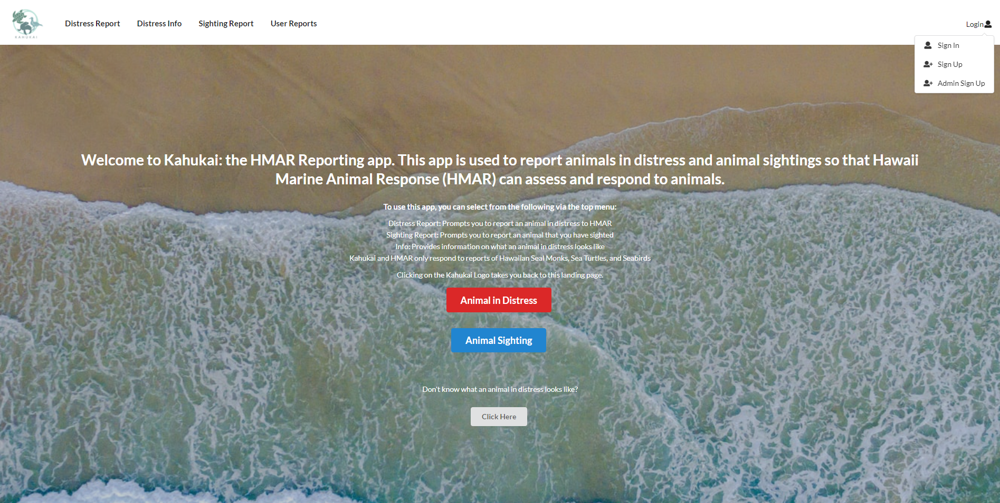
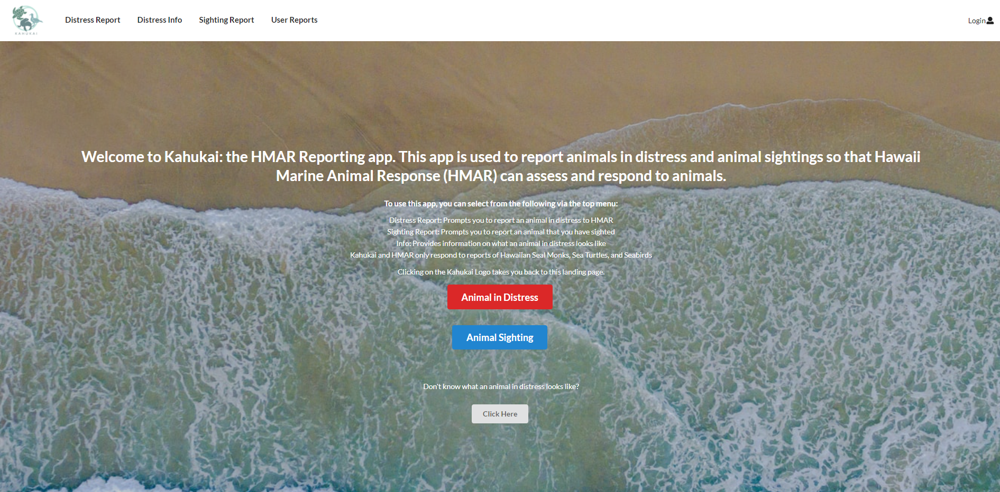
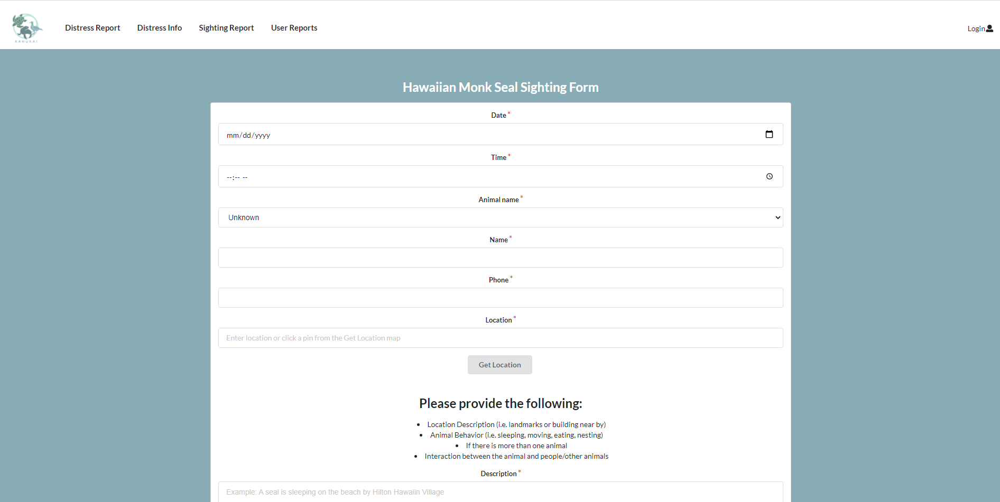
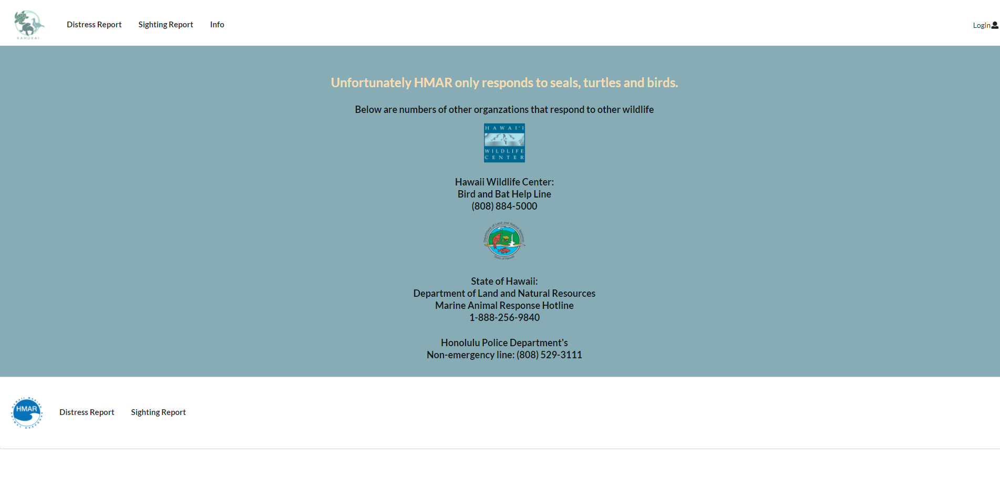
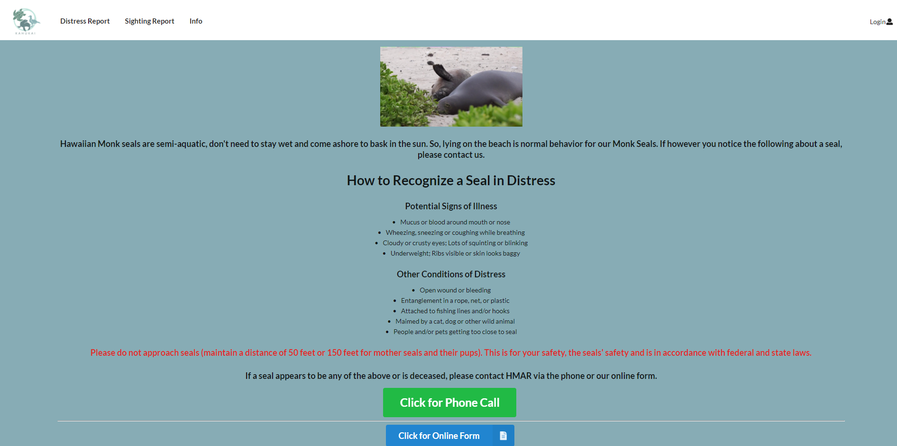
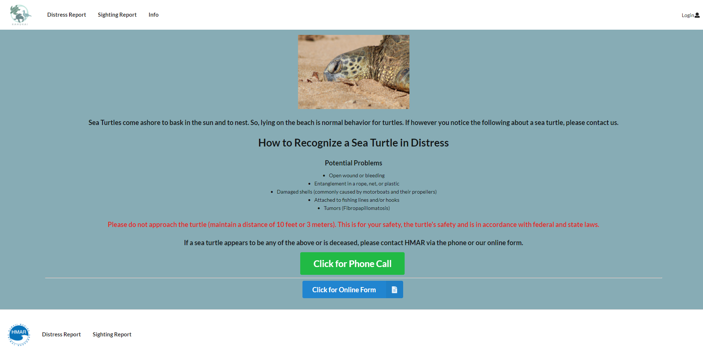
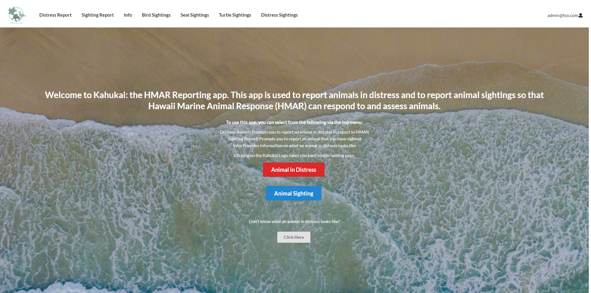
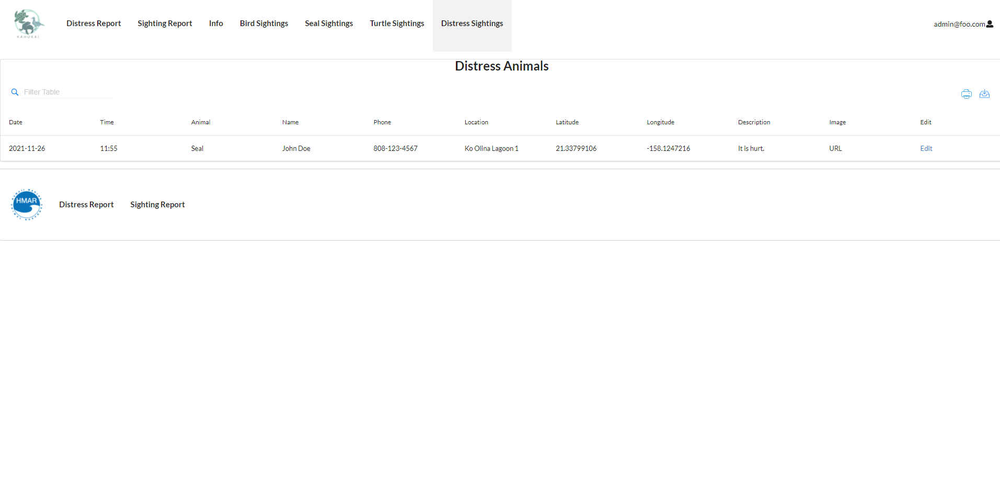

## Bloombugs HMAR Application

## Table of contents

* [Overview](#overview)
* [User Guide](#user-guide)
* [Community Feedback](#community-feedback)
* [Deployment Guide](#deployment)
* [Development History](#development-history)
* [Contact Us](#contact-us)

## Overview

For HACC 2021, we decided to choose the challenge proposed by NIC Hawaii, the Hawaii Marine Animal Response (HMAR) Sighting & Reporting App. Currently HMAR handles all animal sighting reports by phone. HMAR and NIC mentioned that they would like to have the ability to handle reports via an application as well - to decrease the amount of phone traffic and confusion as well as make it easier to record each sighting.

Our solution for HMAR HACC’s problem is the Kahukai web browser application that will be accessible on both mobile and computer. We have different landing pages for the public users who are reporting animal sightings on the go and for the admin users accounts who are the HMAR staff that are managing the sighting reports database. There is a login page for the admin users to access these additional capabilities. The public users are shown a landing page with a link to the animal in distress form, animal sighting forms, and a more information page. The admin users have a landing page with a link to submitting a report, and a link to view logs of all past submitted reports. When a report is submitted it will be added to the list of records that the admin users view. We are using Meteor to create the application and MongoDB will be used to store the animal sightings. Using Meteor will allow the application to be supported on a web browser and mobile devices. The application will be hosted on a Digital Ocean droplet. 

For our Bloombugs project in ICS 314 we built off our HMAR HACC solution where we have each user including the public users register and log in, to have an individual state for each account. It is individualized through having the public users being able to view their history of past submitted reports. We also added a function of admin users being able to edit and delete the submitted reports. We use the same tech stack as the HMAR HACC and also additional technologies such as ESLint, IDPM, Semantic UI/React; the application is stylized aesthetically and optimized for access on most standard devices.

## User Guide

This section provides a walk-through of the HMAR application user interface and its capabilities.

### Landing Page

The landing page is presented to all users when they visit the top-level URL to the site.

### Sign In, Sign Up, Admin Sign Up

Click on the "Login" dropdown in the right hand corner of the navbar, then select the "Sign In" navigation. This will bring you to the "Login to your account" page and login with your credentials. 

In the "Login" dropdown there is also a "Sign Up" navigation to go to the "Register your account" page which lets new regular users create a new account. 

In the "Login" dropdown there is also a "Admin Sign Up" navigation to go to the "Register your admin account" page which lets new admins create new a new account. There is a unique "Admin Password" that is required to sign up as a new admin user which will only be known to the admin organization.

### Public User Landing Page

After logging in as a public user, you are taken to public user landing page which will display three buttons: "Animal in Distress", "Animal Sighting", and "Click Here". Currently, the "Report a Sighting" button on the admin landing page will redirect to this same public user landing page. 

### Animal in Distress

This page shows a red "Click for Phone Call" button alongside HMAR's phone number which encourages users to first call to report an animal distress. Below that there is a green "Click for Online Form" button which will let the user fill out an animal distress form in the case they cannot call the number provided. 

### Animal Sighting

This page show four different buttons with images for sighting reports according to the animal being reported: "Hawaiian Monk Seal", "Turtle", "Bird" and "Other". The forms all take in the date, time, animal name (species), name of person (reporting), phone number, location, description, markers, number of people (in the area of the animal), and image (preferably as a URL). 

As there is only one species of Hawaiian Monk Seal, there is no option to specify the type of seal spotted. There is an option to choose whether it is an adult, baby, or seal with pups in the "Animal name" field.

The Turtle and Bird forms allow for the user to click on the photo to specify the type of turtle or birds spotted. 

The Other form page will let the user know that HMAR does not respond to reportings of any other animals besides Hawaiian Monk Seals, Turtles, and Birds, but there are other organizations that can be contacted if wishing to make a report.

### Click Here

This page shows four different buttons for information on how to tell if the Hawaiian Monk Seal, Turtle, or Bird are in distress and an Other page. 

The distress information pages will give the user a general bullet-pointed list on telling whether an animal is distressed. Below the lists there is a warning to not approach the animal and to keep a distance in accordance with federal and state laws. There is also a button to call the HMAR phone number as well a button to submit a distress form. 

The Other information page will let the user know that HMAR does not respond to reportings of any other animals besides Hawaiian Monk Seals, Turtles, and Birds, but there are other organizations that can be contacted if wishing to make a report.

### Admin User Landing Page

After logging in as an admin user, you are taken to the admin user landing page which will display two buttons: "Report a Sighting" and "Look at Records". The "Report a Sighting" button redirects the admin user to the public user landing page as described above. In the Navbar the admin can look through the Seal, Turtle, Bird, and Distress records.

### Look at Records

This page redirects to the record tables for the Seal, Turtle, Sea Bird, and Distress Animals sightings. The record table shows the information that was submitted on the forms by all users. 

Currently there are only editing capabilities for the "Distress Animals" reports. To edit a specific distress report, the admin user can click on the "Edit" hyperlink which will direct the user to the "Edit Report" page.

## Community Feedback

The feedback asked what people liked and disliked about our app and what could be added or changed to make the app better. Below are the comments of some members of the community: 
- "I liked that you can report different animals seperating. I wouldn't mind a live chatting feature." - Nelson L.
- "I like the ease of being able to select the animal and location quickly. Also being able to upload photos was nice. I think making the map a little easier to navigate for the pins would be good." - Natalie W.
- "I like the infor on animals and distress signs like what to look for. I also liked that you gave references for other animals like whales. It was kinda hard to see the definition for the pages." - Melanie P.
- "Very informational when an animal is in distress, I liked the interactive map. Adding links to the other organizations because HMAR doesn't respond to other animals would be cool" - Matt P.
- "Easy to read and understand, being able to drop a pin would be cool because I don't know what landmarks are around or if I don't know what beach" - Mila S. 

## Deployment Guide

Currently the app can be accessed via the deployed application running on Digital Ocean or by deploying locally on your machine.

Here is the link to the deployed application running on [Digital Ocean](http://165.232.156.4/). You can log in as an admin with "admin@foo.com" with password "changeme" or as a regular user with "john@foo.com" with password "changeme". You can also create a new regular user by clicking on "Login" on the right hand corner of the Navbar and selecting "Sign up" from the dropdown menu.

To deploy locally on your machine, clone the [application repository](https://github.com/bloombugs/application) to your machine. After cloning the repository, open Terminal on Mac or Command Shell on PC. To access the cloned repository type "cd" into the path of its folder in Terminal/Command Shell. Then, once in the local repository folder, "cd app" to begin deployment. 

Once in the app folder, type "meteor npm install" in Terminal/Command Shell to install meteor which runs the application. You may have to wait for a while for meteor to finish installing. After meteor installation, type "meteor reset" in Terminal/Command Shell which resets the database and also initializes two default users, 1) "admin@foo.com", an admin user and 2) "john@foo.com", a regular user. Currently, the default passwords for both of the users is "changeme" on the application. To then run the application, type "meteor npm run start" in Terminal/Command Shell and the application will begin to run. Once "App running at: http://localhost:3000/" shows up on the Terminal/Command Shell, you can access your locally deployed application in a web browser, preferably Chrome, at http://localhost:3000/. If deployment is successful, the landing page should show up in your web browser.

To modify the system, first make a branch on whichever GitHub client you are using; make sure not to make any changes on the "master" branch. Change to the newly made branch then open IntelliJ IDEA and open the cloned repository directory. Please do not change anything in any folder other than "app". Once the project is opened in IntelliJ IDEA, you can change anything as required. Most of the functionality will be located in folders "app/client", "app/imports", and "app/public". Folder "app/client" contains the main HTML and Javascript files, along with the style.css file. Folder "app/imports" contains the folders "api", "startup", and "ui", which is where the bulk of the application is located, i.e. the components/layout/pages in "ui". Folder "app/public" contains all of the images that are on the application. 

Please refrain from deleting anything or changing the names of any files or exports as the application is very modular and multiple components will import/access different files and exports. Once you have made any changes to the application, feel free to push the changes on the branch that you have checked out. 

## Development History

### Milestone 1: Finish HACC application

The goal of Milestone 1 is to finish the HACC application. The link to our Milestone 1 project page can be found [here](https://github.com/bloombugs/application/projects/1). 

The issues that we have completed for Milestone 1 have all been merged with the HACC branch and are as follows:
* Issue-03, make the sign-in page so a user can sign into their accounts and add to the Navbar.
* Issue-04, make the sign-up page so a user can make an account.
* Issue-08, make the distress info page for the monk seals so a user can identify if a monk seal is in distress.
* Issue-09, make the distress info page for the sea birds so a user can identify if a sea bird is in distress.
* Issue-10, make the distress info page for the sea turtles so a user can identify if a sea turtle is in distress.
* Issue-14, fix the buttons for choosing an animal as previously only clicking directly on the text, instead of any place on the button, worked.
* Issue-16, update the selection of locations for all forms using a map of O'ahu.
* Issue-17, implement clickable images to populate a text field.
* Issue-19, deploy the application on Digital Ocean.
* Issue-23, update the landing page with basic information about the application and HMAR along with application navigation assistance.

### Milestone 2: Add users / admin functionality, “Beyond the Basics”

The goal of Milestone 2 is to add public user and admin user functionality. "Beyond the basics" includes: database filter functionality; standardizing date, time, and locations, reporting seal identifying markings, identification of seabird species, updating "click for more information". The link to our Milestone 2 project page can be found [here](https://github.com/bloombugs/application/projects/2)

The issues that we have completed for Milestone 2 are as follows:
* Merged with HACC: issue-06, changing Navbar options for admin user only; issue-07, make table of records page for the sea turtle records; issue-11, update the sea bird form for drop down; issue-12, make a table of records page for the sea bird records; issue-13, make a table of records page for the monk seal, issue-15, update the monk seal form for drop down; issue-22, update the sea turtle form for drop down; issue-24, distress admin database; issue-25, style the form pages; issue-28, fix buttons clicking.
* Issue-21, make clickable images to fill text areas for sea bird and sea turtles species.
* Issue-26, allow admin users to edit submitted distress forms for all users.
* Issue-31, boost sign up page so that another admin can sign up/register.
* Issue-34, create the testcafe acceptance tests for local running and on Github.
* Issue-42, re-deploy all Milestone 2 resolved issues and most updated version of the application on Digital Ocean.

### Milestone 3: User functionality and UI/UX, "Secret Sauce"

The goal of Milestone 3 is to add more user functionality, improve the UI/UX, and add our special "secret sauce" that makes our application truly unique. The link to our Milestone 3 project page can be found [here](https://github.com/bloombugs/application/projects/4).

The immediate issues that we have completed for Milestone 3 are as follows:
* Issue-27, allow admin user to delete forms that have already been submitted.
* Issue-32, fix a refresh error for admin user sign-up so that it is automatically refreshed and does not require user to manually refresh.
* Issue-35, allow regular users to look at their report history.
* Issue-44, add default data to seed the application with realistic data.
* Issue-45, ask the community for feedback about the application.
xxxxx

* Issue-05, make the admin user landing page to have a button to go to the "report a sighting" page and another button to go to the "look at records" page.
* Issue-29, update the Navbar to be more user-friendly with improved UI/UX.
* Issue-36, further testcafe acceptance tests for all of the updated functionality.
* Issue-37, update the CSS style files for consistency and aesthetics.
* Issue-38
* Issue-40, add functionality so that admin users can edit the three animals submitted sighting forms.
* Issue-41, optimize the web application for most devices.
* Issue-46, re-deploy the finished application on a Digital Ocean droplet.

## Contact Us

### Our Team

HMAR application is designed, implemented, and maintained by [Jacob Hardy](https://jakehardy95.github.io/), [Kelly Hwang](https://hwangkyh.github.io/), [Kiana Walters](https://kianaleilani.github.io/), [Kylie Higashionna](https://kyliehigashionna.github.io/), and [Taryn Takebayashi](https://microtaryn.github.io/).

### In the News

The HACC version of the HMAR application won 2nd place in the Hawai'i Annual Code Challenge 2021. 

* [HACC News Releases: 2021 Hawai'i Annual Code Challenge Winners Are...](https://hacc.hawaii.gov/main/2021-hawaii-annual-code-challenge-winners-are/)
* [University of Hawai'i News: UH students code their way to victory in statewide contest](https://hawaii.edu/news/2021/11/26/students-code-statewide-contest/)
* Our previous iteration on [Digital Ocean](http://147.182.184.239/)
