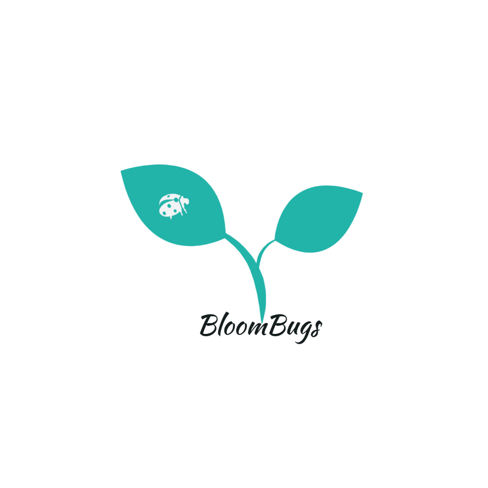
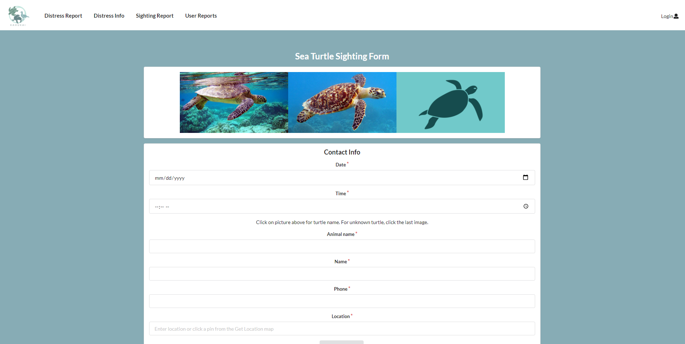
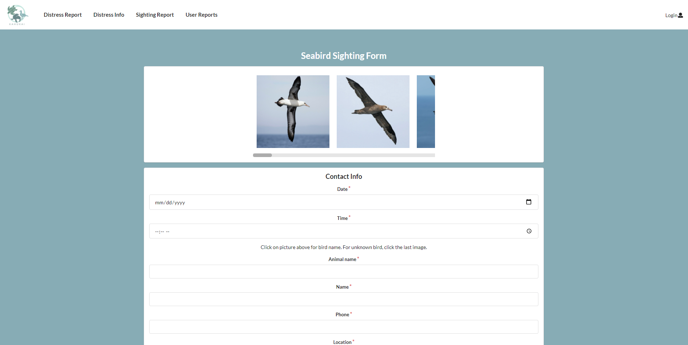
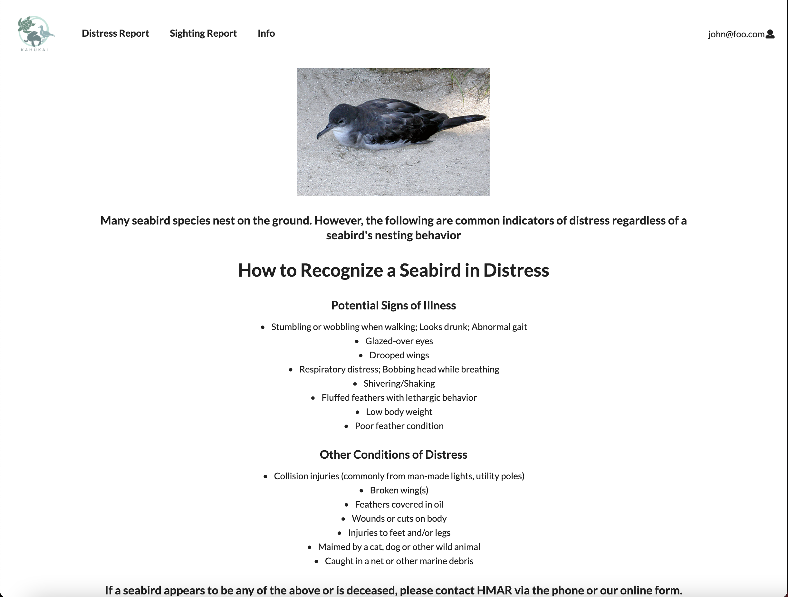
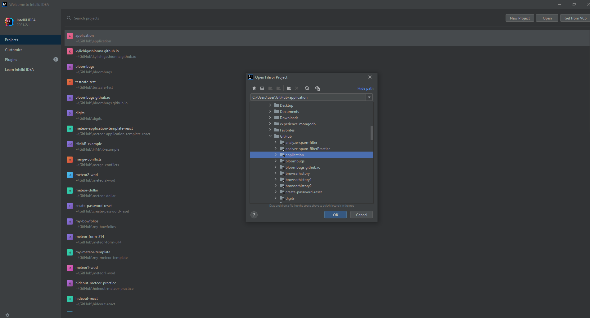
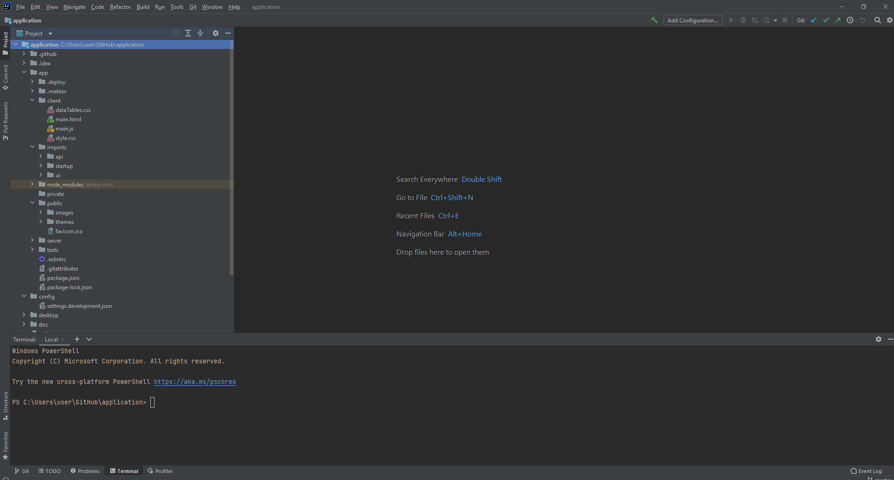

## Bloombugs HMAR Application

## Table of contents

* [Overview](#overview)
* [User Guide](#user-guide)
* [Community Feedback](#community-feedback)
* [Deployment Guide](#deployment)
* [Development History](#development-history)
* [Contact Us](#contact-us)

## Overview

For HACC 2021, we decided to choose the challenge proposed by NIC Hawaii, the Hawaii Marine Animal Response (HMAR) Sighting & Reporting App. Currently HMAR handles all animal sighting reports by phone. HMAR and NIC mentioned that they would like to have the ability to handle reports via an application as well - to decrease the amount of phone traffic and confusion as well as make it easier to record each sighting.

Our solution for HMAR HACC’s problem is a web browser application that will be accessible on both mobile and computer. We will have different landing pages for the public users who are reporting animal sightings on the go and for the admin users accounts who are the HMAR staff that are managing the sighting reports database. There will be a login page for the admin users to access these additional capabilities. The public users will be shown a landing page with a link to the animal in distress form, animal sighting form, and a more information page. The admin users will have a landing page with a link to submitting a report, or viewing a log of all past submitted reports. When a report is submitted it will be added to the list of records that the admin users view. We are using Meteor etc. to create the application and Mongo will be used to store the animal sightings. Using Meteor will allow the application to be supported on a web browser and mobile devices. The application will be hosted on a Digital Ocean droplet. 

For our Bloombugs project we are building off our HMAR HACC solution where we will have each user including the public users register and log in, to have an individual state for each account. It will be individualized through having the public users being able to view their history of past submitted reports. We also will add a function of editing one’s profile to make it more personalized for each user. We will be using the same tech stack as the HMAR HACC and also additional technologies such as ESLint, IDPM, Semantic UI/React.

## User Guide

This section provides a walk-through of the HMAR application user interface and its capabilities.

### Landing Page

The landing page is presented to users when they visit the top-level URL to the site.

### Sign in and sign up

Click on the "Login" button in the upper right corner of the navbar, then select "Sign in" to go to the following page and login.

### Profile edit page

Allows user to store the information about the user.

### Public user landing page

After logging in as a public user, you are taken to public user landing page which will display three buttons: Animal in distress, Animal sighting, and More information. The enter a new report page for the admin user will redircted to this page.

### Animal in Distress

This will show HMAR's phone number.

### Animal sighting pages

This will show four different pages with the same layout. It will be the seal, bird, turtle, and other pages.

### Click for more information

This page will show the user how to spot an animal in distress.

### Admin user landing page

After logging in as an admin user, you are taken to admin user landing page which will display two buttons: Report a sighting and Look at Records. Clicking the report a sighting will redirect to the public user landing page. Clicking the look at records will redirect to the Look at records page. 

### Look at records page

This is the record database for all the submitted forms.

## Community Feedback

We have yet to received any community feedback as of now.

## Deployment Guide

Currently the app can be accessed via the deployed application running on Digital Ocean or by deploying both locally on your local machine.

Link to the deployed application running on Digital Ocean [here](http://147.182.184.239/). You can log in as an admin with "admin@foo.com" with password "changeme" or as a regular user with "john@foo.com" with password "changeme". You can also create a new regular user by clicking on "Login" on the right hand corner of the Navbar and selecting "Sign up" from the dropdown menu.

To deploy locally on your machine, clone the [application repository](https://github.com/bloombugs/application) to your machine. After cloning the repository, open Terminal on Mac or Command Shell on PC. To access the cloned repository type "cd" into the path of its folder in Terminal/Command Shell. Then, once in the local repository folder, "cd app" to begin deployment. 

Once in the app folder, type "meteor npm install" in Terminal/Command Shell to install meteor which runs the application. You may have to wait for a while for meteor to finish installing. After meteor installation, type "meteor reset" in Terminal/Command Shell which resets the database and also initializes two default users, 1) "admin@foo.com", an admin user and 2) "john@foo.com", a regular user. Currently, the default passwords for both of the users is "changeme" on the application. To then run the application, type "meteor npm run start" in Terminal/Command Shell and the application will begin to run. Once "App running at: http://localhost:3000/" shows up on the Terminal/Command Shell, you can access your locally deployed application in a web browser, preferably Chrome, at http://localhost:3000/. If deployment is successful, the landing page should show up in your web browser.

To modify the system, first make a branch on whichever GitHub client you are using; make sure not to make any changes on the "master" branch. Change to the newly made branch then open IntelliJ IDEA and open the cloned repository directory. Please do not change anything in any folder other than "app". Once the project is opened in IntelliJ IDEA, you can change anything as required. Most of the functionality will be located in folders "app/client", "app/imports", and "app/public". Folder "app/client" contains the main HTML and Javascript files, along with the style.css file. Folder "app/imports" contains the folders "api", "startup", and "ui", which is where the bulk of the application is located, i.e. the components/layout/pages in "ui". Folder "app/public" contains all of the images that are on the application. 

Please refrain from deleting anything or changing the names of any files or exports as the application is very modular and multiple components will import/access different files and exports. Once you have made any changes to the application, feel free to push the changes on the branch that you have checked out. 

## Development History

### Milestone 1: Finish HACC application

The goal of Milestone 1 is to finish the HACC application. A link to our Milestone 1 project page can be found [here](https://github.com/bloombugs/application/projects/1)

### Milestone 2: Add users / admin functionality, “Beyond the Basics”

The goal of Milestone 2 is to add public user and admin user functionality. "Beyond the basics" includes: database filter functionality; standardizing date, time, and locations, reporting seal identifying markings, identification of seabird species, updating "click for more information". The link to our Milestone 2 project page can be found [here](https://github.com/bloombugs/application/projects/2)

The issues that we have completed for Milestone 2 are as follows:
* Merged with HACC: issue-06, changing Navbar options for admin user only; issue-07, make table of records page for the sea turtle records; issue-11, update the sea bird form for drop down; issue-12, make a table of records page for the sea bird records; issue-13, make a table of records page for the monk seal, issue-15, update the monk seal form for drop down; issue-22, update the sea turtle form for drop down; issue-24, distress admin database; issue-25, style the form pages; issue-28, fix buttons clicking.
* Issue-21, make clickable images to fill text areas for sea bird and sea turtles species.
* Issue-31, boost sign up page so that another admin can sign up/register.

### Milestone 3: Polishing and optimizing for all devices

The goal of Milestone 3 is optimize the web application for all devices. 

## Contact US

### Our Team

HMAR application is designed, implemented, and maintained by [Jacob Hardy](https://jakehardy95.github.io/), [Kelly Hwang](https://hwangkyh.github.io/), [Kiana Walters](https://kianaleilani.github.io/), [Kylie Higashionna](https://kyliehigashionna.github.io/), [Taryn Takebayashi](https://microtaryn.github.io/).
